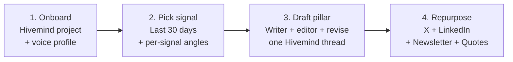
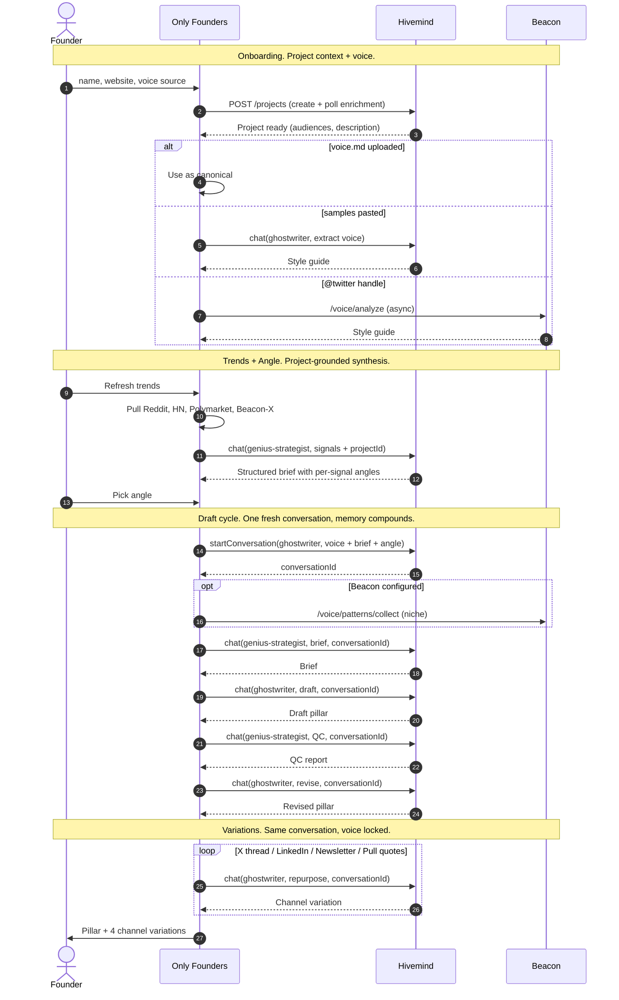

# Only Founders

> Founder-led content that's indistinguishable from the founder's own writing.

OF. Not the other one.

A Hivemind-grounded content pipeline that takes one founder, one signal from the last 30 days, and one chosen angle, and produces a pillar piece plus four channel variations that sound like the founder wrote them. Not "in their voice." Theirs.

Built for the Hivemind Hackathon. Tracks: **Marketing Automations** (primary), **Product Growth** (secondary).

---

## The problem

Founder content has two failure modes.

The first: the founder writes it themselves, it's good, it's rare, the calendar dies after week three.

The second: a ghostwriter or generic AI writes it, the cadence holds, but everyone can tell. The cost of being caught is higher than the cost of posting nothing.

Most tools optimize for cadence. Only Founders optimizes for the thing that breaks if you optimize for cadence.

---

## What it does

Three stages, one founder, one signal at a time.

**1. Trends + Angle.** Pulls the last 30 days from Reddit, Hacker News, Polymarket, and (when Beacon is configured) X. Hivemind synthesizes a structured brief grounded in the founder's project context, not a generic round-up. Each signal arrives with tight angle suggestions anchored to that one signal. Pick one or write your own.

**2. Draft.** A fresh Hivemind conversation per cycle. Niche patterns from Beacon (optional). Brief written by `genius-strategist`. Draft pillar written by `ghostwriter`. QC pass by `genius-strategist` playing editor. Revised pillar by `ghostwriter` applying the QC. Two personas, one thread, memory compounds across calls.

**3. Variations.** The revised pillar gets repurposed into X thread, LinkedIn (native, not cross-posted), Newsletter, and Pull quotes. All four run inside the same conversation thread the draft was written in, so the variations inherit voice and argument without needing to be told.

The Compare page is the proof. Two pieces, shuffled: generic AI and Only Founders. Blind. The room picks which one sounds like a real founder wrote it.

---

## How Hivemind plugs in

The hackathon brief draws a line between *wrapping* Hivemind and *leveraging* it. This is the second one.



Four stages. Hivemind sits in every one of them: project context at onboarding, project-grounded synthesis at trends, persona-routed writer/editor split at draft, channel adaptation at repurpose. Conversation memory carries from stage 3 into stage 4 so the variations inherit voice and argument without being told.

<details>
<summary><b>Deeper view: full call sequence (mermaid sequenceDiagram)</b></summary>



The diagram reads top to bottom. Four things to notice:
- Onboarding creates a project. Every Hivemind call downstream is tied to it.
- The draft cycle opens one conversation. Brief, draft, QC, revise, and all four variations run inside it. Persona changes per call, conversation does not.
- The trends step calls Hivemind *with the project context* attached. Same signals, different founders, different briefs.
- We route to **two of Hivemind's four personas**, deliberately. `general-assistant` is the catch-all the [persona guide](https://github.com/Myosin-xyz/hivemind-plugin/blob/main/skills/hivemind/references/personas.md) itself recommends omitting. `gtm-architect` is for launch planning, not editorial review. Every call goes to the specialist whose lane it actually sits in.

</details>

**Persona routing**

| Step | Persona | Why this one |
|---|---|---|
| Trend brief synthesis | `genius-strategist` | Analysis from raw signals to a structured brief is messaging-architecture work, not writing |
| Brief | `genius-strategist` | The pillar's strategic spine, picked angle becomes argument |
| Draft pillar | `ghostwriter` | Production-ready voice-matched copy |
| QC | `genius-strategist` | 8-lens editorial review (voice consistency, focus discipline, anti-AI-slop). Strategist plays editor to the writer. Different persona than the one that wrote, which avoids self-confirming review. |
| Revised pillar | `ghostwriter` | Apply QC fixes, ship-ready |
| X thread, LinkedIn, Newsletter, Pull quotes | `ghostwriter` | Channel-native adaptation, same voice |

Why this matters for the build: the strongest claim Only Founders makes against generic AI is "voice-locked." That claim collapses if you let the catch-all persona touch the writing thread. The pipeline is a writer/editor split where ghostwriter writes and strategist reviews. Two roles, two personas, no drift.

**Conversation threading is the architecture, not a feature.**

Every founder gets a Hivemind project on onboarding. Every draft cycle opens a fresh conversation tied to that project, seeded with the voice profile, the trend brief, and the chosen angle. Brief, draft, QC, revise, and all four variations run inside that one thread. The `ghostwriter` writing the LinkedIn variation has read the QC and the revised pillar without us pasting them back in. That's the memory layer doing work.

**Project context shapes the trend brief.**

Trends synthesis runs through Hivemind chat with the project's conversation context attached. Same Reddit thread, same HN post, two different founders, two different briefs. The signals are the same. The interpretation is positioned.

**The gotcha we hit.**

First version reused `founder.conversationId` across every generation. Hivemind started caching against the most-recent draft in the thread, so a brand new angle would produce the previous draft. The fix is documented in [`lib/pipeline.ts:150`](lib/pipeline.ts). Fresh conversation per cycle, seeded explicitly. Onboarding's conversationId is now just the anchor, not the writing thread.

---

## Architecture

```
app/
  page.tsx                Founders list + entry point
  onboard/page.tsx        Voice triad capture + Hivemind project create
  generate/page.tsx       Three-stage pipeline UI (Trends/Angle → Draft → Variations)
  compare/page.tsx        Blind side-by-side comparison (Claude vs Only Founders)
  api/
    founders/             CRUD
    onboard/              Onboarding pipeline trigger
    trends/               Multi-platform trend fetch + Hivemind synthesis
    generate/draft/       Stage 1 (SSE stream)
    generate/variations/  Stage 2 (SSE stream)
    baseline/             Generic-AI generator for the Compare page

lib/
  pipeline.ts             Orchestrator. Stage 1 + Stage 2. Events stream over SSE.
  hivemind.ts             Hivemind API client. Projects, chat, conversations, enrichment polling.
  beacon.ts               Beacon API client. Voice, patterns, signal feed.
  trends.ts               Reddit + HN + Polymarket + Beacon-X fetch and synthesis.
  trendBriefParser.ts     Parses Hivemind-generated brief into structured cards for the UI.
  prompts.ts              All persona prompts in one place.
  store.ts                JSON-on-disk persistence (.data/founders.json).
  voiceSchema.ts          voice.md schema enforcement.
  niches.ts               Niche → Beacon keyword mappings.
  types.ts                Shared TS types.
```

Stack: Next.js 16 (canary), React 19, Tailwind v4. SSE for pipeline streaming. JSON-on-disk for state (hackathon scale, swap to KV/Supabase for Vercel). Node runtime on API routes that need the FS or long max durations.

`AGENTS.md` flags that this Next.js version has breaking changes from training data. Read `node_modules/next/dist/docs/` before writing anything in `app/`.

**About Beacon.** A few of the integrations above route through Beacon (the X signal feed, the niche-pattern collector, and the optional Twitter-handle voice analyzer). Beacon is Myosin's production voice + signal API, a separate module that runs independently from Only Founders. All Beacon-backed features degrade gracefully if it's not configured. The pipeline still runs without it, just with fewer signal sources and one fewer voice-input option.

---

## Demo flow (what a teammate could run on Monday)

1. `npm run dev`, open `http://localhost:3000`.
2. Click **+ Onboard founder**. Paste a name, website, and either a voice.md (canonical), 2-3 writing samples (extracted), or a Twitter handle (Beacon analyzes async). Submit. Hivemind project gets created and enriched. Voice gets resolved.
3. From the founders list, click **Generate**. Default niche topic is pre-loaded; refresh trends if needed.
4. Read the brief. Pick an angle chip from one of the signal cards, or write your own anchored to one signal.
5. Click **Generate draft**. Watch the pipeline stream: niche patterns (if Beacon configured) → brief → draft pillar → QC → revised pillar. Each output streams in as the step lands.
6. Read the revised pillar. If it ships, click **Continue to Variations**. Otherwise hit **↻ Regenerate** with a different angle.
7. Click **Generate variations**. X thread, LinkedIn, Newsletter, Pull quotes stream in serially.
8. Open the **Compare** page. Two pieces, shuffled. Blind. The room picks which one sounds like a real founder wrote it.

Full cycle, voice-locked, end to end, in roughly 4-5 minutes once trends are cached.

---

## Hackathon submission notes

**Marketing Automations (primary).** Founder-led content is the canonical marketing workflow that ghostwriters and AI tools both fail at differently. This build chains 9+ Hivemind calls inside one conversation thread, routes deliberately to two specialist personas (writer + editor), pulls project context into trend synthesis, and produces output that could not exist without Hivemind's knowledge layer and persona stack. The output a founder gets on Monday is a pillar plus four channel variations, all voice-matched, all anchored to one real signal from the last 30 days.

**Product Growth (secondary).** Founders are not currently Hivemind's user base. They are exactly the user base Hivemind is best positioned to serve. Only Founders puts Hivemind output in front of founders without making them learn the API, the personas, or the prompt structure. If the voice-match holds in the blind test, this is the demo that moves a founder from "what's Hivemind" to "I need an account."

**Self-assessment against the rubric.**

- *Hivemind Depth (30%)*: deliberate routing (writer + editor, not catch-all), conversation threading, project-grounded trend synthesis, documented gotcha-and-fix. Not a wrap.
- *Roadmap Viability (25%)*: this is the shape of a managed-service offering for founders. The architecture is already a product, not a workflow.
- *Demo Clarity (20%)*: three-stage UI, streaming pipeline, blind compare page. A non-technical person sees output appear and votes in under two minutes.
- *Originality (25%)*: voice-triad fallback (voice.md > samples > Twitter), per-signal angle suggestions, project-grounded trend synthesis instead of generic round-ups, blind-test compare as the proof artifact.

---

## Setup

```bash
npm install
cp .env.example .env.local
# fill in HIVEMIND_API_KEY (required)
# fill in BEACON_API_URL + BEACON_API_KEY (optional, enables voice/X)
npm run dev
```

Required env:
- `HIVEMIND_API_KEY`: from Mitch or the [API request form](https://myosin.typeform.com/api-request).

Optional env (graceful degrade if missing):
- `HIVEMIND_API_URL`: defaults to `https://hivemind.myosin.xyz`.
- `BEACON_API_URL`, `BEACON_API_KEY`: enables Twitter voice analysis, niche patterns, X signal feed.
- `ANTHROPIC_API_KEY`: used by the Compare baseline generator.

State lives in `.data/founders.json`. Delete to reset. Don't commit it.

---

## Known gaps and what we want from Hivemind

The hackathon brief asks for gaps encountered during the build. Three made it through the critical filter: the ones that cost real time and have concrete fixes.

**Conversation memory is implicit.** The caching gotcha (fresh thread per draft cycle) cost us a debugging session. Hivemind started caching against the most-recent draft in a thread, so a new angle would produce the old draft. We work around it by opening fresh conversations. A first-class "reset memory" or "fork conversation from message N" primitive would have been the right tool.

**Error envelopes split across endpoints.** Chat returns flat `{ error: 'code', message: '...' }`. Projects/Knowledge return wrapped `{ success: false, error: { code, message } }`. We normalize in [`lib/hivemind.ts:21`](lib/hivemind.ts). A unified envelope would save every integrator the same five lines.

**No token streaming from chat.** We stream the *pipeline events* (step started, step completed) over SSE, but each individual Hivemind chat call is a blocking POST. Token-level streaming would let us render the draft writing itself in real time. That moment, watching a paragraph appear in your own voice, is when a founder buys in.

---

## Future directions

The architecture this hackathon ships is already a product, not a workflow. Five extensions are queued for the next phase:

**More signal sources.** Today: Reddit, Hacker News, Polymarket, and X (via Beacon). The natural expansion is non-text signal: TikTok transcripts, YouTube transcripts, Substack feeds, podcast feeds. A founder positioning against a creator's recent thesis on YouTube should be able to anchor a pillar to that signal directly, not paraphrase it.

**More variation formats.** Today: pillar plus X thread, LinkedIn-native, Newsletter, Pull quotes. Next: TikTok script, podcast outline, X reply templates per audience segment, B-side variants (provocative vs measured) of the same pillar. Channel set scales with how the founder shows up.

**Performance feedback loop.** Once a variation ships, ingest its analytics (likes, comments, saves, profile clicks, replies). Feed back into the brief step as "what worked / what didn't" per founder. The tool learns which hook patterns and angle shapes land for *this specific founder*, not the population average.

**Multi-founder / agency mode.** One operator running 10 founders' calendars. Bulk trends fetch across all niches, parallel draft cycles, a unified review queue with per-founder voice locks. The shape of FDM-as-managed-service.

**Learning loops.** The voice profile, the angle ranker, and the brief generator all start fixed at onboarding. Over months, they should drift toward the founder's actual published voice (not just the seed voice.md), the angle types they consistently pick (some founders pick "story" 80% of the time, others "contrarian"), and the briefs that produced their best-performing pieces. Voice profile, angle selector, and brief writer become *learned components per founder*, not static templates. Closes the loop between "we wrote it" and "they shipped it and it worked."

The cohesive vision is a managed-service offering for founders: drop a voice.md or a Twitter handle, get a weekly pillar + variations queued for approval, grounded in project context the system keeps refreshing from your site, podcast appearances, and recent posts. The voice-triad becomes a voice-quintet. Compare becomes the customer's onboarding moment. Hivemind is the spine.

---

## Links

- Hivemind API: <https://hivemind.myosin.xyz/api-docs>
- Hivemind Plugin: <https://github.com/Myosin-xyz/hivemind-plugin>
- Hivemind Skills: <https://github.com/Myosin-xyz/hivemind-skills>
- Beacon: production-only, internal. Auth via `x-api-key`.
